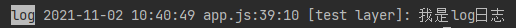
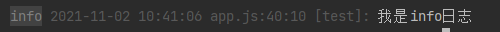
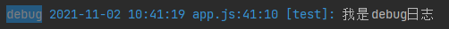
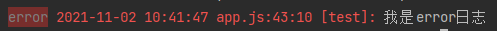
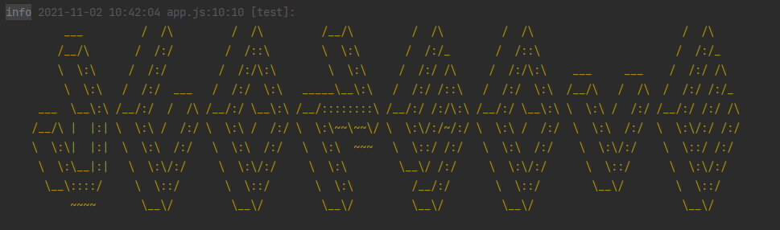
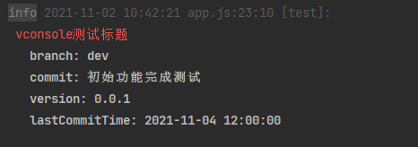

# 🚀 NConsole
> ⌨️ 该工具仅用于node端开发时打印格式化日志，便于日志的管控

> ⌨️ 原计划是将browser和node版本兼容为一个版本，开发中发现browser和node控制台输出样式方式是不一致的，且考虑node端后期可能会增加日志文件输出等功能，没办法很好的兼容browser端，计划将browser端拆分为新的一个工具库VConsole(🔗)

### ❤️ 插件的背景和目标
___
- 背景 - 在实际开发项目中想更好的控制输出打印、更快的进行日志筛选、更样式化的定制打印


- 目标 - 尽可能简单的api, 与原生console api保持一致。


- 声明 - 该插件旨在减化自己工作中重复工作的工具，实现原理简单，自身能力有限，使用者勿喷，如果有好的想法和建议也可在issue中提出

### ✨️ 插件的基本功能
___
 - 支持日志分级别打印，不同级别日志显示不同颜色区分 ✓
 - 支持日志控制开关 ✓
 - 支持日志过滤标记 ✓
 - 内置一些常见打印，比如提交日志、图标 - （部分完成，部分待完善） 
 - 内置一些测试性能的打印 - （待完成）
 - 支持日志文件本地输出 - （待完成）

### 😊️  插件的使用
___
📦 Install:
```bash
$ yarn add @achengyu/nconsole
```

🔨 Usage

Import to your script:
```js
    require('@achengyu/nconsole')
```

Use in code:
```javascript
    nconsole.log('test', '我是log日志')
    nconsole.info('test', '我是info日志')
    nconsole.debug('test', '我是debug日志')
    nconsole.warn('test', '我是warn日志')
    nconsole.error('test', '我是error日志')
```

### ✌  插件的选项
___
#### 一些前置概念
```javascript
    支持的日志等级(与开发者工具等级分类基本一致)
        [
            // 默认等级
            'DEFAULT',
            // 普通日志
            'LOG',
            // 信息日志
            'INFO',
            // 调试日志
            'DEBUG',
            // 警告日志
            'WARNING',
            // 错误日志
            'ERRORS'
        ]

    日志实例:
        nconsole内部没有导出任何实例给外部, 只在require时自动生成了一个实例并挂载到了global对象上,
        也就是说你可以在global对象上直接找到nconsole这个实例, 在代码中像调用原生console一样直接
        调用nconsole
        
    tag的格式要求：
        tag参数是一个字符串数组类型([xxx xxx xxx]), 多个tag间用空格符号间隔，代码逻辑中对多tag
        进行过滤匹配，因此这么约定
```

#### 全局配置项
该插件默认不需要配置，但可以对其进行配置以支持自定义日志控制功能:

```javascript
    nconsole
        .setting
        // 开启日志打印，表示是否开启插件
        .setEnabled(true)
        // 开启日志打印所在的文件、行号信息(由于日志打印所在的文件、行号是通过throw Error捕获错误实现)，这样会存在
        // 一个问题是项目中如果存在错误监控系统是全局检查错误的，会将此错误计入，造成体验不好，增加这个选项用于开关
		.setEnableStackInfo(true)
        // 设置过滤的tag，表示需要过滤打印的tag日志
        .filterTags(['test'])
        // 设置过滤的等级，表示需要过滤打印的日志等级
        .filterLevel([nconsole.CONSOLE_TYPE.DEBUG])
```

#### 内置函数

#### nconsole.log(tag: string, ...msg: any[])

```javascript
nconsole.log('test', '我是log日志')
```


<br/>

#### nconsole.info(tag: string, ...msg: any[])
```javascript
nconsole.info('test', '我是info日志')
```


<br/>

#### nconsole.debug(tag: string, ...msg: any[])
```javascript
nconsole.debug('test', '我是debug日志')
```


<br/>

#### nconsole.warn(tag: string, ...msg: any[])
```javascript
nconsole.warn('test', '我是warn日志')
```


<br/>

#### nconsole.error(tag: string, ...msg: any[])
```javascript
nconsole.error('test', '我是error日志')
```


<br/>

#### nconsole.ascii(tag: string, content: string, color?: string)
```javascript
nconsole.ascii('test', `
          ___         /  /\\         /  /\\         /__/\\         /  /\\         /  /\\                       /  /\\
         /__/\\       /  /:/        /  /::\\        \\  \\:\\       /  /:/_       /  /::\\                     /  /:/_
         \\  \\:\\     /  /:/        /  /:/\\:\\        \\  \\:\\     /  /:/ /\\     /  /:/\\:\\    ___     ___    /  /:/ /\\
          \\  \\:\\   /  /:/  ___   /  /:/  \\:\\   _____\\__\\:\\   /  /:/ /::\\   /  /:/  \\:\\  /__/\\   /  /\\  /  /:/ /:/_
      ___  \\__\\:\\ /__/:/  /  /\\ /__/:/ \\__\\:\\ /__/::::::::\\ /__/:/ /:/\\:\\ /__/:/ \\__\\:\\ \\  \\:\\ /  /:/ /__/:/ /:/ /\\
     /__/\\ |  |:| \\  \\:\\ /  /:/ \\  \\:\\ /  /:/ \\  \\:\\~~\\~~\\/ \\  \\:\\/:/~/:/ \\  \\:\\ /  /:/  \\  \\:\\  /:/  \\  \\:\\/:/ /:/
     \\  \\:\\|  |:|  \\  \\:\\  /:/   \\  \\:\\  /:/   \\  \\:\\  ~~~   \\  \\::/ /:/   \\  \\:\\  /:/    \\  \\:\\/:/    \\  \\::/ /:/
      \\  \\:\\__|:|   \\  \\:\\/:/     \\  \\:\\/:/     \\  \\:\\        \\__\\/ /:/     \\  \\:\\/:/      \\  \\::/      \\  \\:\\/:/
       \\__\\::::/     \\  \\::/       \\  \\::/       \\  \\:\\         /__/:/       \\  \\::/        \\__\\/        \\  \\::/
           ~~~~       \\__\\/         \\__\\/         \\__\\/         \\__\\/         \\__\\/                       \\__\\/
`, '#E6A23C')
```


<br/>

#### nconsole.version(tag: string, titleParams: { title: string, color?: string }, contentParams: { content: string, color?: string })
```javascript
nconsole.version(
    'test',
    {
        title: 'vconsole测试标题',
        color: '#dd2a09'
    },
    {
        content: `
    branch: dev
    commit: 初始功能完成测试
    version: 0.0.1
    lastCommitTime: 2021-11-04 12:00:00
        `
    }
)
```
